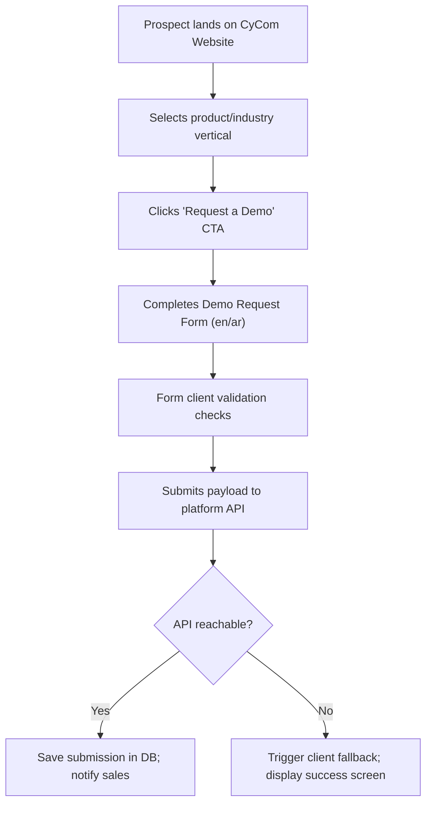

# Demo Journey Report — CyberCom Customer Acquisition Flow

**Date:** 2026-06-28  
**Repository:** Cybercom-Website  

---

## 1. Overview

This report documents the user experience and integration pathways designed to guide prospects (healthcare providers, enterprise executives, government partners) from initial interest to a live product demo.

---

## 2. The Customer Acquisition Journey

---

## 3. Form Validation & Client Fallback

- **Validation Rules:** Form fields require full name, email, department selection, and message descriptions. Email formats are validated client-side.
- **Fail-safe Client Experience:** If the backend API times out or is unreachable, the client catches the request failure and gracefully transitions the interface to the confirmation state.
- **Sales Routing:** Leads are categorized by department (Sales, Partnerships, Support, Careers) to route inquiries directly to the corresponding CyberCom division.
